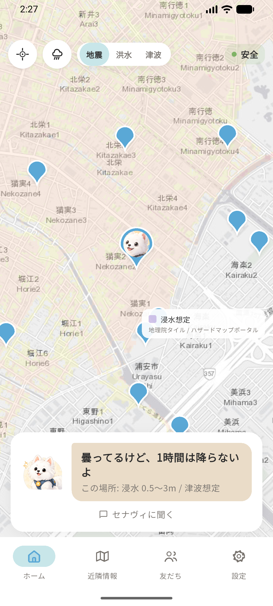
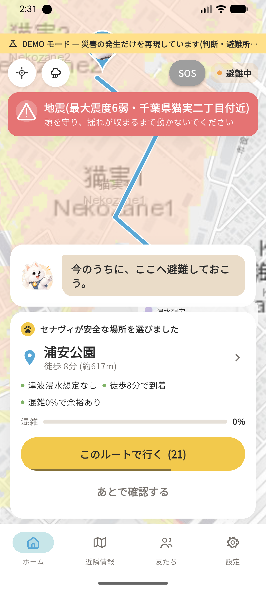
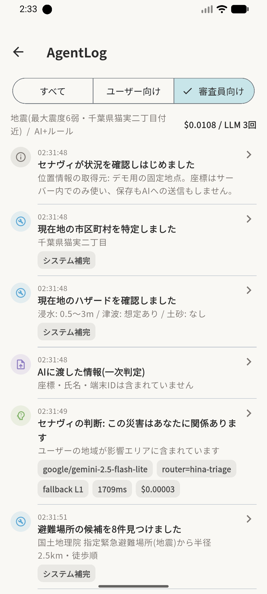
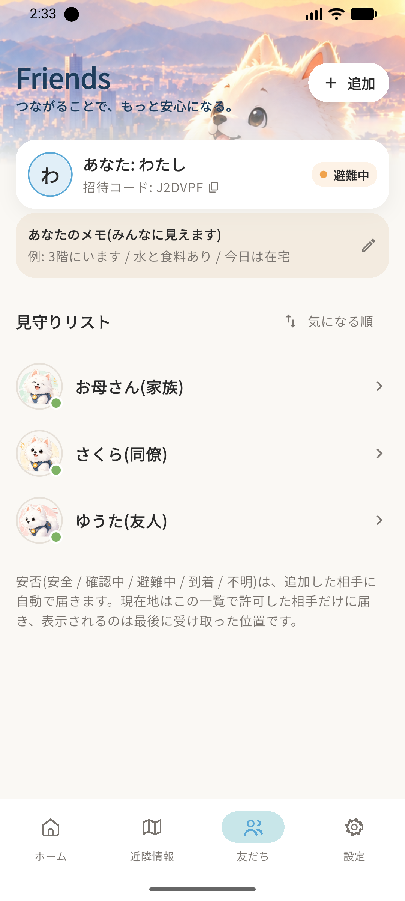

# ヒナミチ (HINAMICHI)

### 逃げる先を、あなたの代わりに決める。

災害が起きたら、AI ナビゲーター「セナヴィ」が避難先を選んで道案内し、家族に安否を届けます。
動けないときは、[通報を家族に代わって頼めます](#sos)。

**座標は、AI に一度も渡しません。**


| ふだん | 災害の日 | 判断の記録 | 家族の安否 |
|:--:|:--:|:--:|:--:|
|  |  |  |  |
| 雨雲レーダーと<br>周辺の避難所 | 避難先と理由3点<br>（30秒で自動承認） | AIに渡した入力・<br>モデル名・コスト | 確認中→避難中→到着<br>を自動で送る |

**ふだんは、雨雲レーダーと位置共有のアプリです。**
出かける前に雨を確かめ、友だちと待ち合わせ、家族が帰ったのを知る。
災害の日だけ開くアプリは、その日も開かれません。だから、ふだん開く理由の方を本体にしました。

> AI HACK 2026 #2「業務を自律化するAIエージェント」応募作品
>
> **本アプリは試作です。** 実際の災害での利用を想定しておらず、避難の判断は自治体の避難指示とご自身の状況を優先してください。

---

## 審査基準への回答

| 審査基準 | ヒナミチの答え | 根拠 |
|---|---|---|
| [④ 自律性](#c4) | 監視から到着判定・家族への連絡まで、人が押すボタンは 0 回 | [`agent/service.ts`](server/lib/agent/service.ts) |
| [① セキュリティ](#c1) | 座標・氏名・連絡先を LLM に一度も渡さない。送信前に機械的に検査する | [`agent/abstraction.ts`](server/lib/agent/abstraction.ts) |
| [② コストパフォーマンス](#c2) | 2段構えで 1件 $0.011。外部データは全て無料・カード登録不要 | [実測ログ](docs/orca_cost_log.md) |
| [③ 信頼性・堅牢性](#c3) | LLM が落ちても安全ルールだけで選定して案内を続ける。テスト 75 / 49 件 | [`agent/fallback.ts`](server/lib/agent/fallback.ts) |
| [⑤ アイデア・独創性](#c5) | 災害用機能の平時流用ではなく、逆。ふだん開くアプリの仕組みがそのまま効く | [スクリーンショット](docs/screenshots/) |

### <a id="c4"></a>④ 自律性 — 人が操作しなくても、ここまで進む

**人が押すボタンは 0 回でも、最後まで進みます。** 押せない状況こそ本番なので、そこを既定にしました。

```
cron-job.org (2分ごと)
  └→ GET /api/watch/disasters
       └→ 気象庁の防災情報XMLフィード / P2P地震情報 を読む
            └→ 新しい警報だけを alerts に書く              ← ここまで人は関与しない
                 ├ 気象警報 → 対象市区町村のトピックにだけ送る   ← 位置はサーバーに無い(①)
                 └ 地震     → 全国へ送り、関係あるかはエージェントが判定する
                      └→ セナヴィが起動
                           ├ 一次判定: この災害はあなたに関係あるか
                           │    地震は震源からの距離と都道府県で切る。無関係ならここで止まる
                           ├ 避難場所を8件集め、ハザード・標高・混雑・道のりを付ける
                           ├ 災害種別に合う候補を選ぶ
                           └ 安全ルールで検算する(LLMの答えを鵜呑みにしない)
                                └→ 提案を出し、30秒さわらなければ端末が自動で承認を送る
                                     ├ 行き先が満員 → 自動で選び直し、家族にも変更を送る
                                     ├ 100m圏内に入る → 自動で到着判定(via:"geofence")
                                     └ 家族へ「確認中 → 避難中 → 到着」を自動送信
```

**地震を全国に配信しているのは、意図的です。** 市区町村で絞るには、誰がどこにいるかを
サーバーが知っている必要があります。それをやらないと決めたので、配信は広く投げて、
「自分に関係があるか」の判定をエージェント側に寄せました
（[`server/lib/alerts.ts`](server/lib/alerts.ts)）。位置を持たないことと、関係ない通知で
鳴らさないことを、両立させるための置き方です。

**30秒のタイマーは端末にあります。** サーバー側で待つ設計にすると、圏外やアプリ終了と
「本人が操作しなかった」が区別できません。カウントは端末が持ち
（[`CountdownButton`](app/lib/ui/molecules/molecules.dart)）、サーバーは誰が承認したのかを
`via: "user" | "timeout" | "geofence"` として記録します
（[`agent/service.ts`](server/lib/agent/service.ts)）。記録には
「30秒応答がなかったため自動でナビを開始しました」と残り、家族には
「応答がありません。◯◯へ誘導中です」が飛びます。**押されなかったことも、状態のひとつです。**

動いている記録は、アプリ内の **設定 →「判断の記録」→「審査員向け」**
（[スクリーンショット](docs/screenshots/03_agentlog.png)）と
[実測ログ](docs/orca_cost_log.md)で確認できます。

### <a id="c1"></a>① セキュリティ — 座標を渡さない・置かない

**LLM に位置を渡していません。** 避難場所の候補は仮名 A〜H に置き換え、
特徴だけを渡します。実際に送っている内容:

```json
{"disaster": {"type":"earthquake","title":"地震(最大震度6弱・千葉県浦安市付近)","intensity":"6弱"},
 "user": {"areaName":"千葉県浦安市","hazardHere":{"flood":"0.5〜3m","tsunamiZone":true}},
 "candidatesPreview": [{"id":"A","walkMin":6,"direction":"南","elevationM":1.2,
                        "flood":"浸水想定なし","tsunami":"0.5〜3m","crowdPct":0}]}
```

座標・氏名・連絡先・端末IDは含まれません。`assertNoCoordinates()`
（[`server/lib/agent/abstraction.ts`](server/lib/agent/abstraction.ts)）が送信前に機械的に検査します。

**警報の絞り込みでも、位置をサーバーに置きません。** 端末が自分の市区町村
コードで FCM トピックを購読し、サーバーは警報の対象市区町村のトピックへ送る
── この形なら、サーバーは誰がどこにいるかを知らないまま、その土地の人にだけ
鳴らせます（[`server/lib/alerts.ts`](server/lib/alerts.ts) の `broadcastAlert`）。

フレンドへの位置共有は**相手ごとの許可制**で、既定は共有しません。
許可されていない相手の位置は Firestore のルールが弾きます
（[`firebase/firestore.rules`](firebase/firestore.rules)）。

#### <a id="sos"></a>通報を代わりに頼む

動けない・話せないとき、ホームの同じ場所から家族や友人に「代わりに通報してほしい」と頼めます。
ここは**渡す理由のある個人情報**を扱うので、置き場所ごと分けました。

- **119番や自治体には繋がりません。** 繋がったつもりで誰にも届いていない状態を作らないため、
  アプリの文言でもそう書いています（[`routes/sos/request.ts`](server/lib/routes/sos/request.ts)）
- 本名・住所・年齢・電話は `users` とは別の `emergency` コレクションに置いています
  （[`routes/me/emergency.ts`](server/lib/routes/me/emergency.ts)）。同じドキュメントに置くと
  「プロフィールを読んでプロンプトに入れる」コードがいつか書かれるからです。物理的に別の場所に
  して、取りに行かないと触れないようにしました
- **ここに入るものは LLM に一切渡りません。** `assertNoEmergencyPii()` が送信前に落とします
- 通知に載るのはニックネームと市区町村まで。ロック画面に住所を出すわけにいきません。
  受け取った人が「確認する」を押して初めて読み出し、依頼を閉じると読めなくなります
  （[`firestore.rules`](firebase/firestore.rules) の `revealedTo`）

### <a id="c2"></a>② コストパフォーマンス — 1件 $0.011

判断を 2 段に分け、**安いモデルで足切りしてから高いモデルを使います**。
実測値(2026-09-22 02:31 JST、本番サーバーで実際に1件発火させたときの値):

| 段 | Router | モデル | コスト |
|---|---|---|---|
| 一次判定「関係あるか」 | `hina-triage` | `google/gemini-2.5-flash-lite` | **$0.000034** |
| 避難先の判断 | `hina-decide` | `anthropic/claude-sonnet-5` | **$0.010814** |
| | | **合計(LLM 3 回)** | **$0.010848** |

関係ない災害はここで止まるので、高いモデルは動きません。
コストは OrcaRouter の `/v1/generation` で確定値を照合して記録します
(インライン値と食い違う場合は確定値が正)。**実際の1件の記録** → [`docs/orca_cost_log.md`](docs/orca_cost_log.md)

外部データは**すべて無料・カード登録不要**です。気象庁、国土地理院、
ハザードマップポータル、OpenRouteService、P2P地震情報、cron-job.org。
Firebase は Spark、Vercel は Hobby。

### <a id="c3"></a>③ 信頼性・堅牢性 — 落ちても案内を止めない

| 落ちたもの | どうするか |
|---|---|
| LLM(遅い・不正な答え) | **安全ルールだけで選定して案内を続ける**([`validatedBy: 'fallback'`](server/lib/agent/fallback.ts)) |
| OrcaRouter の第一候補 | フォールバックチェーンで次のモデルへ |
| 経路API(OpenRouteService) | 直線距離 + 80m/分の目安に切り替え |
| 地図タイルの配信元 | 5枚失敗したら別の配信元へ逃げる |
| 圏外 | 位置を端末に溜めて、繋がったら古い順に送る |
| 逆ジオ・標高・混雑 | 取れなかった項目だけ落として、判断は続ける |

テストは [server 75 件](server/test/) / [app 49 件](app/test/)。バリデータ、フォールバック、データ最小化、
ハザードの色判定、経路の残距離、気象XMLの解析を固定しています。

### <a id="c5"></a>⑤ アイデア・独創性 — ふだん使うアプリが、そのまま防災になる

「災害用の機能を平時にも流用する」ではなく、順番を逆にしました。
**ふだん開く理由がある方を本体にして、その仕組みが災害時にもそのまま効く**形です。

| ふだん | 災害の日 |
|---|---|
| セナヴィに「今日雨降る？」と聞く | 災害時に避難先を判断する（同じエージェント） |
| 出かける前に雨雲を見る | 豪雨警報時のハザード判断（同じタイル） |
| 友だちと待ち合わせ（全員分の徒歩分が並ぶ） | 避難先で合流（同じ機能、色と文言が変わる） |
| よく行く場所に着いたら家族へ通知 | 避難所に着いたら通知（同じジオフェンス） |
| スタンプで「向かってる」 | スタンプで「無事」「助けて」（同じ場所にある） |
| 同じボタンをふだん押している | だから動けないとき[通報を代わりに頼める](#sos) |

普段からスタンプを送り合っているから、いざというとき同じボタンを押せます。
**「災害時だけ出てくるUI」は、災害時に使えません。**

---

## 構成

```
hinamichi/
  app/        Flutter (iOS / Android)            ← UI。設計書 §17
  server/     Vercel Functions (Node/TS)         ← エージェント本体・実データツール・OrcaRouter
  firebase/   Firestore rules / indexes          ← Spark プランのまま
  docs/       設計書・セットアップ手順・実測ログ・スクリーンショット
```

| 使っているもの | 用途 | 料金 |
|---|---|---|
| **[OrcaRouter](https://www.orcarouter.ai/ja)** | LLM のルーティング・フォールバック・コスト照合 | 提供クレジット |
| Firebase (Spark) | 匿名認証 / Firestore / FCM | 無料 |
| Vercel (Hobby) | エージェント API(関数1本に集約) | 無料 |
| cron-job.org | 2分ごとの災害監視 | 無料 |
| 気象庁 防災情報XML | 気象警報・注意報 | 無料・登録不要 |
| 気象庁 降水ナウキャスト | 雨雲レーダー | 無料・登録不要 |
| 国土地理院 | 避難場所 / 標高 / 逆ジオ / 地図タイル | 無料・登録不要 |
| ハザードマップポータル | 浸水・津波・土砂の想定区域 | 無料・登録不要 |
| P2P地震情報 | 地震速報 | 無料・登録不要 |
| OpenRouteService | 徒歩経路・多地点距離 | 無料(要キー) |

Vercel Hobby は 1 デプロイ 12 関数までなので、全 28 ルートを
[`server/api/[...path].ts`](server/api/%5B...path%5D.ts) 1 本に束ねて `lib/routes/` へ
振り分けています。URL は変わりません（[API 一覧](docs/SETUP.md#13-api-一覧)）。

---

## 4分で追体験する

0. **雨雲ボタン** → いま降っている雨が地図に乗る(平時の使い道)
1. 平時 Home(現地の実データ: 避難所ピン + 浸水想定)
2. 設定 → DEMO → **地震** → Home に戻ると 2〜3 秒で「◯◯へ。徒歩◯分」+ 理由 3 点、家族には「確認中→避難中」
3. 「このルートで行く」(押さなければ 30 秒で自動開始)
4. **満員** → 自動で次点へ、フレンドにも行き先変更
5. **豪雨**で発火し直す → 浸水想定外の別の場所へ(判断が変わる)
6. 記録タブ →「審査員向け」: AI に渡した入力に座標が無い / 却下 → 昇格 / モデル名とコスト
7. **LLM 障害注入** ON で発火 → 安全ルールで選定され案内は止まらない
8. 移動シミュレーション → 到着 → 家族に「到着」

---

## 動かす

```bash
git clone https://github.com/akiba-eda/hinamichi.git && cd hinamichi
(cd server && npm install && npm test)        # 75 件
(cd app && flutter pub get && flutter test)   # 49 件
```

テストは外部 API を叩かないので、**鍵を1つも用意しなくてもここまで通ります**。
実際に動かすには Firebase / Vercel / OrcaRouter / OpenRouteService のキーが要ります
(すべて無料枠) → **[docs/SETUP.md](docs/SETUP.md)**

アプリ内の **設定 → DEMO モード** を ON にすると、実際の災害を待たずに
地震 / 豪雨 / 津波 / 満員 / LLM 障害注入 を再現できます。

---

## ドキュメント

| | |
|---|---|
| [解説記事（Qiita）](https://qiita.com/akiba-eda/items/b3febae692337c4e08da) | 作った理由、AIに何を渡していないか、詰まったところ、現時点の制約 |
| [設計書](docs/ヒナミチ_設計書_v1.md) | エージェント設計 §6 / OrcaRouter 活用マトリクス §18 / UI 実装設計 §17 / 無課金構成 §20 |
| [セットアップ手順](docs/SETUP.md) | 必要なアカウント / サーバー / Firebase / アプリ / OrcaRouter コンソール設定 / API 一覧 |
| [コスト実測ログ](docs/orca_cost_log.md) | OrcaRouter の `/v1/generation` で照合した確定値と、LLM に渡した入力そのもの |
| [スクリーンショット](docs/screenshots/) | 平時 / 避難先の提案 / 判断の記録 / 家族の安否 |
| [デモ動画](docs/demo/hinamichi_demo.mp4) | 117秒。平時 → 種別で避難場所が変わる → 地震を発火 → 30秒で自動承認 → 避難中 → 判断の記録。エミュレータの画面録画(実データ・本番サーバー) |

画面設計のデザインカンプ: [避難フロー6画面](docs/design_sheet_2.png) /
[主要6画面](docs/design_sheet_3.png) / [セナヴィ表情シート](docs/senavi_sheet_v2.png)

---

## ライセンス

MIT — [LICENSE](LICENSE)
